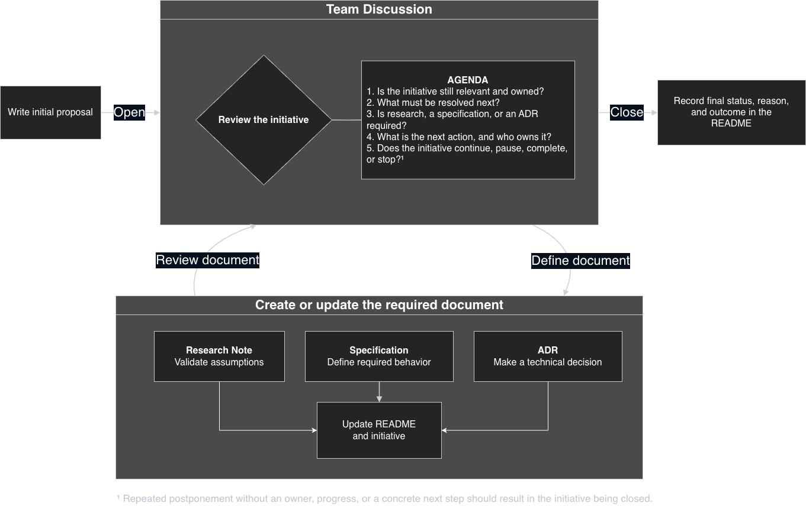

# Cradle

A documentation structure for one technical initiative. It is **files only, with no required tools or services**. Everything is plain Markdown in a Git repository: proposals, specifications, ADRs, research notes, and todos. No database, app, or proprietary format is required.

Each document type has a template and a clear responsibility. The structure captures decisions and reasoning when they are formed instead of losing them to chat logs and memory.

A generated repository is self-contained and can be standalone, inside an implementation repository, or part of a monorepo.

## Create a Cradle

Run the Cookiecutter template through `uvx` in a container. No local installation of Cookiecutter or `uv` is required.

You will be prompted for a `project_name`. The generated folder name is automatically slugified with dashes.

```bash
docker run --rm -it \
  --user "$(id -u):$(id -g)" \
  -e HOME=/tmp \
  -v "$PWD:/work" \
  -w /work \
  ghcr.io/astral-sh/uv:debian \
  uvx cookiecutter \
    --checkout main \
    https://codeberg.org/dominikfalkner/cradle.git
```

To inspect the generated structure without running the template, browse the [`{{cookiecutter.repository_name}}/`]({{cookiecutter.repository_name}}/) directory. It includes an example [README]({{cookiecutter.repository_name}}/README.md) and [CONVENTIONS.md]({{cookiecutter.repository_name}}/CONVENTIONS.md).

### Development container

The generated repository includes a devcontainer with Quarto, TinyTeX, LuaLaTeX, Python, Jupyter, Git, and PDF utilities.

Install the [Dev Containers](https://marketplace.visualstudio.com/items?itemName=ms-vscode-remote.remote-containers) extension for VS Code. Open the generated folder and run **Dev Containers: Reopen in Container**, then run:

```bash
quarto check
```

## Usage

### Start with the initiative

Every initiative starts with `proposal.md`.

The proposal defines:

* the problem or opportunity;
* the objective;
* scope and constraints;
* assumptions and risks;
* measurable success criteria;
* the initiative owner;
* the responsible team and stakeholders;
* the current status;
* the last and next review dates.

The proposal should include the following metadata:

```markdown
## Status

`Proposed`

## Ownership

- Initiative owner:
- Responsible team:
- Stakeholders:

## Review

- Last reviewed:
- Next review:
```

The proposal is the anchor for all other documents.

### Review the initiative as a team

The team discussion is the control point for the initiative. Hold it when opening the initiative, when a document is ready for review, when work reaches a decision point, or when the initiative may need to pause or close.

Use the following agenda:

1. Is the initiative still relevant and owned?
2. What must be resolved next?
3. Is research, a specification, or an ADR required?
4. What is the next action, and who owns it?
5. Does the initiative continue, pause, complete, or stop?

Each discussion must result in at least one of the following:

* create or update a document;
* create or update a todo;
* assign a concrete next action and owner;
* start or continue agreed work;
* pause the initiative with a reason and next review date;
* close the initiative with a final outcome.

Repeated postponement without ownership, progress, or a concrete next step should result in the initiative being marked as `Abandoned`.

### Create only the documents you need

Create a research note when an assumption must be validated or evidence is needed before making a decision.

Create a specification when required behavior, interfaces, constraints, failure modes, or acceptance criteria must be defined.

Create an ADR when a significant technical choice is made, especially when several reasonable options exist or the decision is difficult to reverse.

Create a todo for temporary action items resulting from an initiative review. Assigned implementation and delivery work belongs in an external issue tracker.

Not every initiative requires every document type.

Documents are created in response to a question, action, or decision identified during the team discussion, not simply because a template exists.

### Workflow

1. Write the initial proposal.
2. Review the initiative with the team.
3. Create or update the required research note, specification, ADR, or todo.
4. Update the proposal and `README.md`.
5. Return the document to the team for review.
6. Repeat the cycle until the initiative is completed, abandoned, or superseded.



### Link documents

The proposal must reference all current specifications, research notes, ADRs, todos, and relevant external work items.

Each document must link back to the proposal and to the documents that informed or constrain it.

Significant decisions must not remain only in chats, meetings, issues, or pull requests. Record them in an ADR and reference the ADR from the proposal.

Use relative Markdown links.

### Repository structure

The generated `README.md` is the living index for the initiative. Keep it current when documents are added, replaced, or archived.

`CONVENTIONS.md` contains the complete rules for identifiers, linking, lifecycle, and archiving.

| Folder | What goes there |
| --- | --- |
| `specs/` | Required behavior, interfaces, constraints, and acceptance criteria |
| `adrs/` | Significant technical decisions and their rationale |
| `research/` | Investigations, evidence, findings, and limitations |
| `todos/` | Temporary action items resulting from initiative reviews |
| `archive/` | Superseded, abandoned, completed, or no longer relevant documents |
| `templates/` | Blank templates for each document type |
| `CONVENTIONS.md` | Repository rules and documentation conventions |

To create a document, copy the matching file from `templates/` and assign the next available four-digit identifier.

For example:

```text
SPEC-0002-user-authentication.md
ADR-0003-use-openid-connect.md
RES-0004-identity-provider-comparison.md
TODO-0005-validate-token-expiry.md
```

Identifiers are permanent and must never be reused.

### Initiative lifecycle

An initiative has one of these statuses:

* `Proposed`
* `Active`
* `Paused`
* `Completed`
* `Abandoned`
* `Superseded`

The status must be visible in both `proposal.md` and `README.md`.

Active and paused initiatives must have an owner and should be reviewed regularly. During a review, confirm that:

* the objective is still relevant;
* the initiative still has an owner;
* linked documents remain accurate;
* open actions have a clear owner;
* the current status is correct;
* the next review date is defined.

A paused initiative must include a reason and a next review date.

Closing an initiative means assigning one of these final statuses:

* `Completed`
* `Abandoned`
* `Superseded`

`Paused` is not a final status.

### Close the initiative

An initiative must be closed explicitly. Do not let it become inactive without explanation.

When an initiative ends, add a final statement to `README.md` containing:

* the final status;
* the closure date;
* why the initiative ended;
* whether the success criteria were met;
* important results or lessons;
* remaining work;
* a replacement initiative, if applicable.

Example:

```markdown
## Final Outcome

**Status:** Completed  
**Closed:** 2026-11-30

The initiative delivered the planned authentication migration. Four of five success criteria were met. The remaining performance work is tracked in the linked follow-up initiative.
```

For an abandoned initiative:

```markdown
## Final Outcome

**Status:** Abandoned  
**Closed:** 2026-09-15

The initiative was closed after repeated reviews produced no owner, progress, or concrete next step. The reason for stopping and any reusable findings are recorded in the linked documents.
```

## Render documents

No Quarto project configuration is required. Render the Markdown file you are working on:

```bash
quarto render proposal.md --to pdf
quarto render proposal.md --to html
```

Rendered files are written next to their source file and are ignored by Git.

## License

This template is licensed under [CC BY 4.0](LICENSE). You may use, modify, and distribute it, including commercially, provided that you attribute this project.

See the [LICENSE](LICENSE) file for the full terms.
